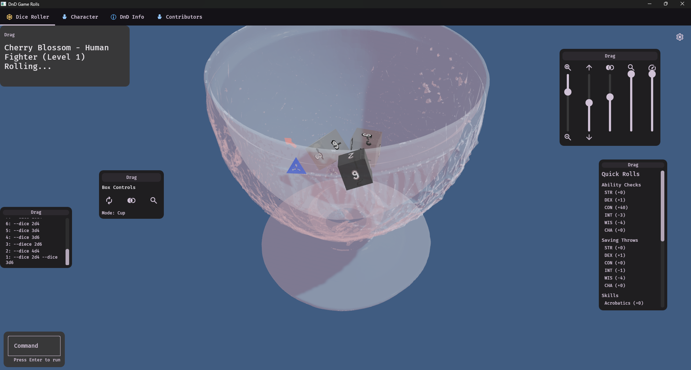
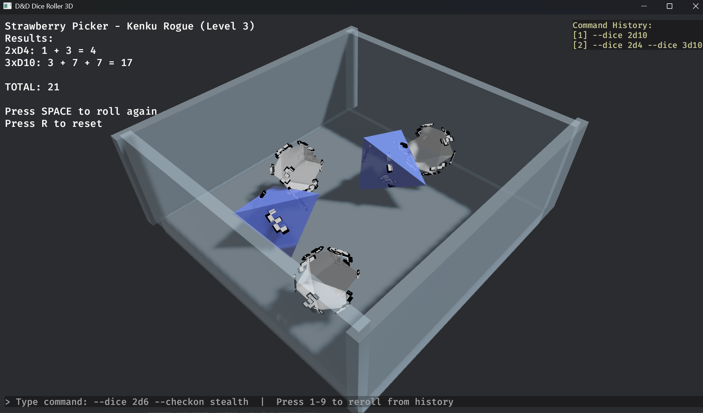
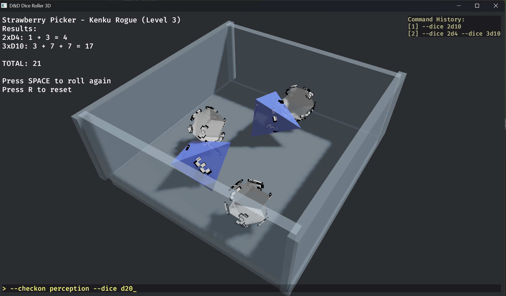
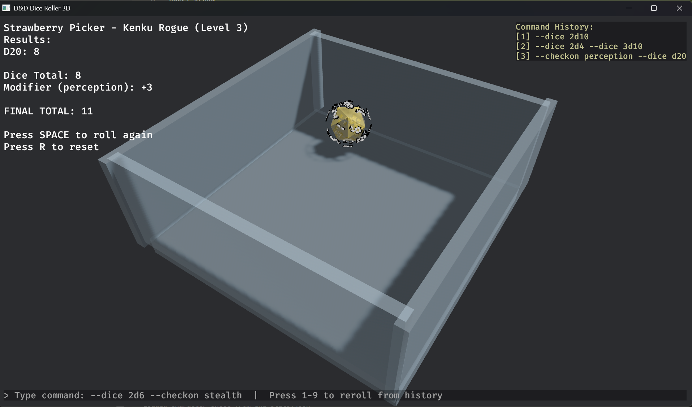

# DnD Game Rolls - D&D Dice Roller

A command-line dice roller for D&D 5e that uses your character stats from a JSON file.  
Includes a **3D Dice Simulator** powered by Bevy game engine!

## Screenshots

### 3D Dice Simulator

| Rolling Dice | Results Display |
|:------------:|:---------------:|
|  |  |

| Command Input | Command History |
|:-------------:|:---------------:|
|  |  |

## Examples

For detailed examples with output, see the [screenshots directory](screenshots/README.md):

- **[CLI Examples](screenshots/cli/README.md)** - Command-line dice roller output samples
- **[3D Dice Simulator](screenshots/dice3d/README.md)** - Visual dice rolling examples

### Quick CLI Examples

```bash
# View character stats
dndgamerolls stats

# Skill check with expertise
dndgamerolls skill stealth
# 🎲 Stealth Check (Expertise)
# Roll: 15 + 9 = 24

# Skill check with advantage (flag BEFORE subcommand)
dndgamerolls --advantage skill perception
# 🎲 Perception Check (Proficient) [Advantage]
# Rolls: 18, 7 → Using: 18
# Roll: 18 + 5 = 23

# Attack roll with damage
dndgamerolls attack dagger
# ⚔️ Dagger Attack
# Attack Roll: 12 + 7 = 19
# Damage: 1d4+5 → 7
```

---

## Installation

### From crates.io (Recommended)

```bash
# Install both CLI and 3D simulator
cargo install dndgamerolls
```

### From Source

```bash
git clone https://github.com/edgarhsanchez/dndgamerolls.git
cd dndgamerolls
cargo build --release
```

The executables will be at:
- `target/release/dndgamerolls.exe` - CLI dice roller
- `target/release/dice3d.exe` - 3D dice simulator

### From GitHub Releases

Download pre-built binaries from the [Releases](https://github.com/edgarhsanchez/dndgamerolls/releases) page.

---

## 3D Dice Simulator (dice3d)

A visual 3D dice rolling experience with physics simulation.

### Running the 3D Simulator
```bash
# From source
cargo run --bin dice3d

# If installed via cargo install
dice3d
```

### Command-Line Options
```bash
# Roll specific dice
dice3d --dice 1d20 --dice 2d6

# Roll with skill check modifier
dice3d --dice 1d20 --checkon stealth

# Combined options
dice3d --dice 1d20 --dice 1d8 --modifier 3
```

### Controls

| Key | Action |
|-----|--------|
| **SPACE** | Roll a complete set of dice (D4, D6, D8, D10, D12, D20) |
| **1** | Spawn D4 (tetrahedron) |
| **2** | Spawn D6 (cube) |
| **3** | Spawn D8 (octahedron) |
| **4** | Spawn D10 (pentagonal trapezohedron) |
| **5** | Spawn D12 (dodecahedron) |
| **6** | Spawn D20 (icosahedron) |
| **R** | Clear all dice |
| **W/A/S/D** | Move camera |
| **Q/E** | Rotate camera |

### Command Input Mode

Press `/` or `Enter` to open command input, then type commands like:
- `--dice 2d6 --checkon stealth` - Roll 2d6 with stealth modifier
- `1d20 --checkon perception` - Roll d20 with perception modifier
- `--dice 1d20 --dice 1d8 --modifier 3` - Roll multiple dice with bonus

Press **1-9** to quickly reroll from command history shown on the right.

### Features
- 🎲 All standard D&D dice types (D4, D6, D8, D10, D12, D20)
- ⚡ Real-time physics simulation with Rapier3D
- 🎨 Crystal-themed translucent dice
- 📦 Glass dice box with realistic bouncing
- 🎯 Automatic result detection when dice stop
- 💡 Dynamic lighting and shadows
- 📝 Command history for quick rerolls

### Custom 3D Models

You can add your own dice models in the `assets/models/` folder. See `assets/models/README.md` for detailed instructions on:
- Supported formats (GLTF/GLB recommended)
- Model requirements and scale
- Converting FBX to GLTF
- Creating dice in Blender

---

## CLI Dice Roller (dndgamerolls)

A command-line dice roller that uses your character stats from a JSON file.

### Usage

#### Ability Checks
Roll ability checks using the full name or abbreviation:

```bash
dndgamerolls strength      # or dndgamerolls str
dndgamerolls dexterity     # or dndgamerolls dex
dndgamerolls constitution  # or dndgamerolls con
dndgamerolls intelligence  # or dndgamerolls int
dndgamerolls wisdom        # or dndgamerolls wis
dndgamerolls charisma      # or dndgamerolls cha
```

#### Initiative
```bash
dndgamerolls initiative
```

#### Skill Checks
```bash
dndgamerolls skill stealth
dndgamerolls skill perception
dndgamerolls skill acrobatics
dndgamerolls skill investigation
```

#### Saving Throws
```bash
dndgamerolls save dex
dndgamerolls save int
dndgamerolls save wisdom
```

#### Attack Rolls
```bash
dndgamerolls attack shortsword
dndgamerolls attack shortbow
dndgamerolls attack dagger
```

#### Advantage/Disadvantage
Add `--advantage` or `--disadvantage` **BEFORE** the subcommand:

```bash
dndgamerolls --advantage dex              # Roll with advantage
dndgamerolls --disadvantage skill stealth # Roll with disadvantage
dndgamerolls --advantage attack shortsword
```

#### View Character Stats
```bash
dndgamerolls stats
```

#### Custom Character File
By default, the tool looks for `dnd_stats.json` in the current directory. You can specify a different file:

```bash
dndgamerolls -f path/to/character.json intelligence
```

## Features

- 🎲 D&D 5e compliant rolls (d20 + modifier)
- ✨ Advantage/Disadvantage support
- 🎨 Colored output with critical success/failure highlighting
- 📊 Displays both dice roll and final total
- 🎯 Automatic modifier calculation from character stats
- 🗡️ Attack rolls with weapon stats
- 💾 Loads character data from JSON file
- 🎭 Shows expertise on relevant skills

## D&D Rules Implemented

- **Natural 20**: Critical success (highlighted in green)
- **Natural 1**: Critical failure (highlighted in red)
- **Advantage**: Roll twice, take the higher result
- **Disadvantage**: Roll twice, take the lower result
- **Proficiency Bonus**: Automatically applied to proficient saves/skills
- **Expertise**: Double proficiency bonus (shown in character stats)

## Character File Format

The tool expects a JSON file with your character stats. See `dnd_stats.json` for the full structure.

## Building for Release

```bash
cargo build --release
```

Copy the executable to a directory in your PATH for easy access:

```powershell
# Windows
copy target\release\dndgamerolls.exe C:\Users\YourName\.cargo\bin\

# Or install directly from source
cargo install --path .
```

Now you can run `dndgamerolls` from anywhere!

## License

See [LICENSE](LICENSE) for details.
