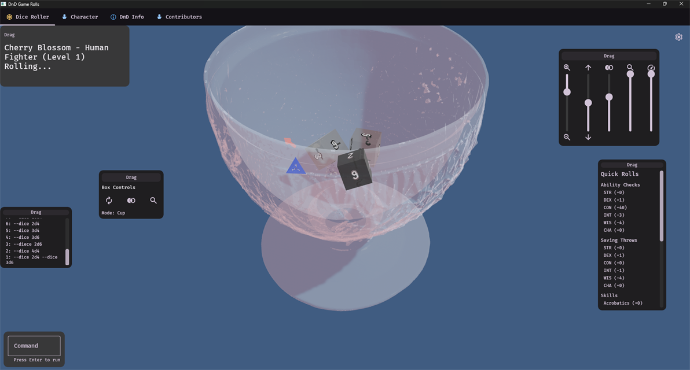
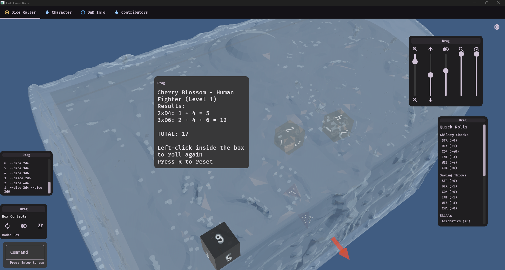

# DnD Game Rolls

	

		

			A D&amp;D 5e dice roller with both <strong>CLI</strong> and a <strong>3D dice simulator</strong> in one app.
			Throw dice with physics, track characters locally, and reroll fast.
		

		

			<a class="btn primary" href="dnd-info.html">Open DnD Info (How Rolls Work)</a>
			<a class="btn" href="https://github.com/edgarhsanchez/dndgamerolls">GitHub Repo</a>
			<a class="btn" href="https://github.com/edgarhsanchez/dndgamerolls/releases">Releases</a>
		

	

	

		
		
	

## Highlights

- 3D dice with physics (box or cup container)
- Character sheet backed by local embedded database
- Quick Rolls (skills / ability checks / saving throws)
- Command history rerolls

## Screenshots

	

		
		
Results display after dice settle

	

	

		
		
Switch container style (box ↔ cup)

	

	

		
		
Command input for quick rolls

	

	

		
		
Command history (click entries to reroll)

	

