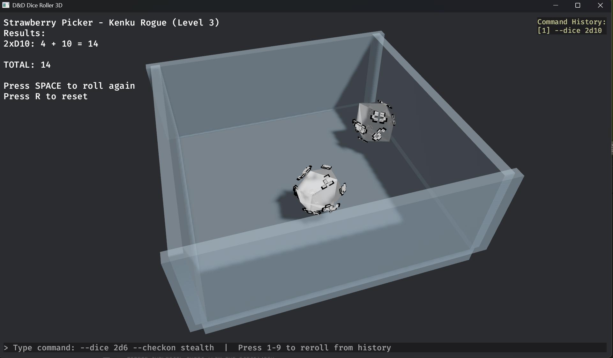

# 3D Dice Simulator Examples

This folder contains screenshots and examples of the dice3d simulator.

## Screenshots

### Basic View
The dice box ready for rolling.



### Dice Rolling
Dice in motion with physics simulation.


### Results Display
Dice settled with results shown in the top-left corner.


### Command Input
Press `/` or `Enter` to open the command input field at the bottom.


### Command History
Previously executed commands appear on the right side. Press 1-9 to reroll.


---

## Example Commands

```bash
# Default roll (1d20)
dice3d

# Multiple dice
dice3d --dice 2d6 --dice 1d20

# With skill modifier
dice3d --dice 1d20 --checkon stealth

# Custom dice combo
dice3d --dice 1d20 --dice 1d8 --modifier 5
```

## In-App Commands

Once running, press `/` or `Enter` to open command input:
- `--dice 2d6 --checkon stealth`
- `1d20 --checkon perception`
- `--dice 1d20 --dice 1d8 --modifier 3`

Press 1-9 to reroll from history.
